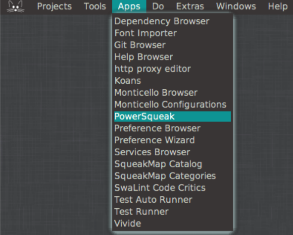
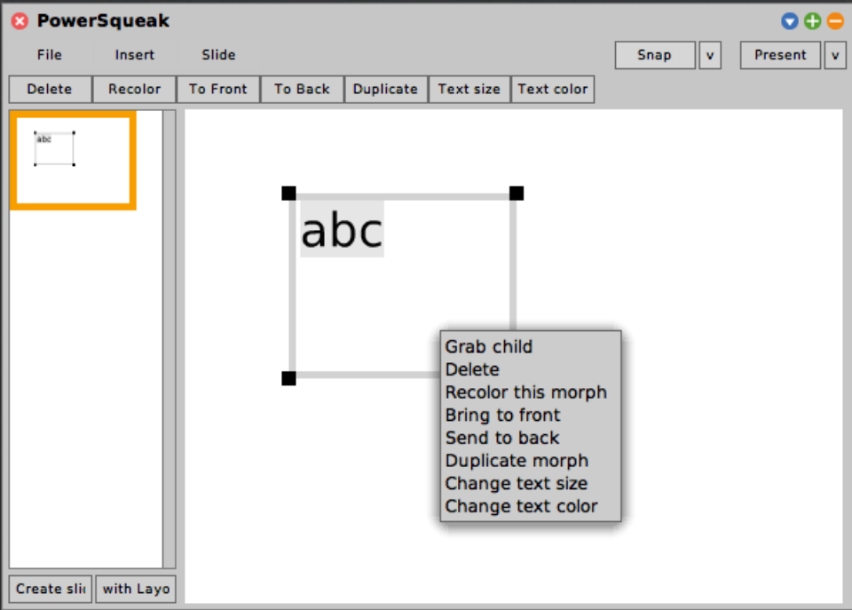
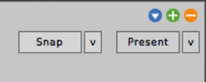
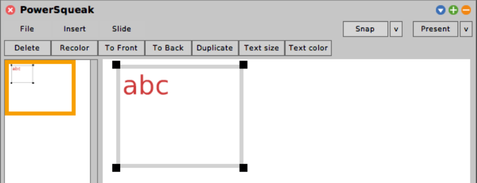

# **PowerSqueak** [](https://travis-ci.org/hpi-swa-teaching/PowerSqueak)[](https://coveralls.io/github/hpi-swa-teaching/SWT18-Project-09?branch=release)

A presentation tool for the Squeak development platform

Supported platforms:
* Squeak 5.1
* Squeak 5.2

Squeak 6.0/Trunk is also a target plattform, but due to the fast changing nature of Trunk, certain versions of Squeak Trunk may not work.
Please check [Travis-ci](https://travis-ci.org/hpi-swa-teaching/PowerSqueak) for the current build status.

Squeak 5.0 is officially unsupported (see [Travis-ci](https://travis-ci.org/hpi-swa-teaching/PowerSqueak)).

## **Overview**
* [Overview](https://github.com/hpi-swa-teaching/PowerSqueak#overview)
* [Installation Instructions](https://github.com/hpi-swa-teaching/PowerSqueak#installation-instructions)
* [Build status](https://github.com/hpi-swa-teaching/PowerSqueak#build-status)
* [Using PowerSqueak](https://github.com/hpi-swa-teaching/PowerSqueak#using-powersqueak)
	* [Edit mode](https://github.com/hpi-swa-teaching/PowerSqueak#edit-mode)
		* [Magnetic Raster](https://github.com/hpi-swa-teaching/PowerSqueak#magnetic-raster)
	* [Presentation mode](https://github.com/hpi-swa-teaching/PowerSqueak#presentation-mode)
		* [Interactive/Non-Interactive mode](https://github.com/hpi-swa-teaching/PowerSqueak#interactivenon-interactive-mode)
	* [saving and loading](https://github.com/hpi-swa-teaching/PowerSqueak#saving-and-loading)
	* [list of shortcuts](https://github.com/hpi-swa-teaching/PowerSqueak#list-of-shortcuts)

## **Installation Instructions**
For easy installation, please first install [Metacello](https://github.com/Metacello/metacello).

Then run the following code in your Squeak 5.1/6.0(trunk) image:
``` smalltalk
Metacello new
	baseline: 'Presenter';
	repository: 'github://hpi-swa-teaching/PowerSqueak:release/packages';
	load.
```

Alternatively, download the .sar file from the [latest release](https://github.com/hpi-swa-teaching/PowerSqueak/releases/latest) and install it into your Squeak image via drag and drop.

## **Build status**
| [Release](https://github.com/hpi-swa-teaching/PowerSqueak/releases/latest) | master
| ------------------------- | ------------------- |
| [](https://travis-ci.org/hpi-swa-teaching/PowerSqueak) | [](https://travis-ci.org/hpi-swa-teaching/PowerSqueak) |
| [](https://coveralls.io/github/hpi-swa-teaching/SWT18-Project-09?branch=release) | [](https://coveralls.io/github/hpi-swa-teaching/SWT18-Project-09?branch=master) |

## **Using PowerSqueak**
To open PowerSqueak either
*	run: ``` PSPresentationTool open. ```
*	click PowerSqueak in the "Apps" drop-down-menu\
	

### **Edit mode**
During edit mode, you can use the menu to save, load or export a presentation. You can insert a text field, an image, a shape or slide numbers with the "insert" button. You can hide, delete, duplicate, move or save a slide as a layout with the "slide" button in the menu bar (see shortcuts). 
You may also drop other Morphs onto slides, but be aware, that some features of those Morphs might not work as expected (scaling most of the time does not work correctly).

For advanced features like deleting morphs or resizing text, right-click the Morph.\


#### **Magnetic Raster**
PowerSqueak supports a magnetic raster for easy layouting.
If the magnetic raster is active, resizing a Morph will automatically snap the corners of the Morph to an imaginary raster.\
To enable the magnetic raster click the button. It will change its color to show that it's activated. 
You can select your snap size by clicking on the small arrow right next to the snap button.\
\


#### **Menu-Bar**
You can now use the features in the Menu bar to edit your text. \


### **Presentation mode**
To enter presentation mode, click the "Present" button.

To control your presentation during presentation mode, use:

| Key | Action |
| ------- | ------- |
| Esc | Leave presentation mode |
| right arrow/arrow down/page down | next slide |
| left arrow/arrow up/page up | previous slide |
| Number keys | Jump to a slide number (0 = last slide) |
| i | (de-)activate interactivity and (un-)hide cursor |

Because PowerSqueak supports slide selection with both arrow and page keys, most wireless presenters will work correctly with PowerSqueak, but pressing the present button on your presenter will not work, as the Squeak VM does not support function keys.

#### **Interactive/Non-Interactive mode**
By pressing "i" during presentation mode, you can disable/enable interactivity and hide/unhide the cursor.
This mode is added to avoid the visual clutter of the cursor and to keep text on slides from grabbing the keyboard input, which prevents you from changing slides.

Leaving the presentation mode also enables interactivity and unhides the cursor.

### **Saving and loading**
PowerSqueak can save and load presentations to/from the file system.

Use the corresponding save/load buttons in the "File" menu to save/load the presentation.
If you want to view the saved files, go to the ```PSPresentation``` directory in your Squeak VMs directory.
You can share presentations by copying any presentation in the ```PSPresentation``` directory into the ```PSPresentation``` directory of another image.
In the other image you can then load the presentation as usual in PowerSqueak.

``` diff
- Warning: some morphs may crash your image if they are saved/loaded!
- It is recommended, that you save your image before every save/load operation in PowerSqueak
```

You may also export your presentation to a list of .png files, which will get exported into the ```PSPresentationsExports``` folder in your Squeak VMS directory

#### **List of shortcuts**
### **Global schortcuts**
| Key | Action|
| ---- | ---- |
| right arrow/arrow down/page down | next slide |
| left arrow/arrow up/page up | previous slide |
| Number keys | Jump to a slide number (0 = last slide) |
| Cmd + t | Create a text field in hand |
| delete | Delete slide (miniature needs to be selected) |
| delete | Delete morph (morph needs to be selected and for deleting a text field, mouse needs to be outside of morph)

### **Edit mode shortcuts**
| Key | Action |
| --- | --- |
| Cmd + i | Create an image |

### **Presentation mode shortcuts**
| Key | Action |
| --- | --- |
| i | (de-)activate interactivity and (un-)hide cursor |
| Esc | Leave presentation mode |
