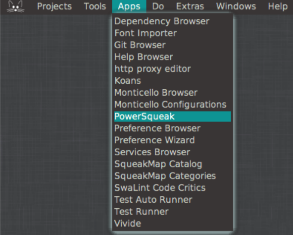
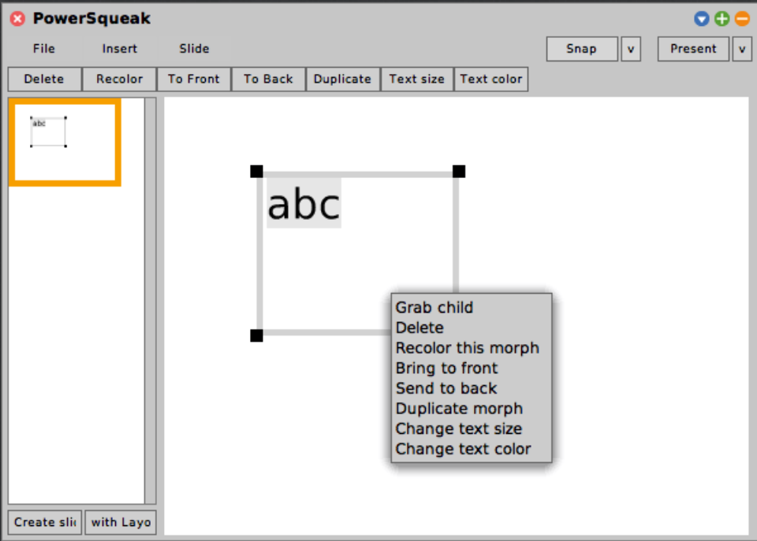
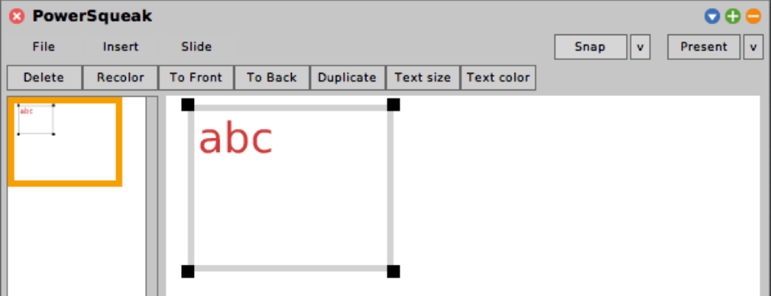
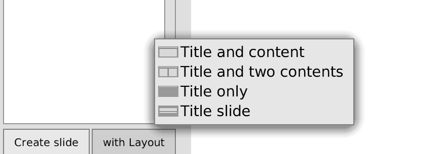
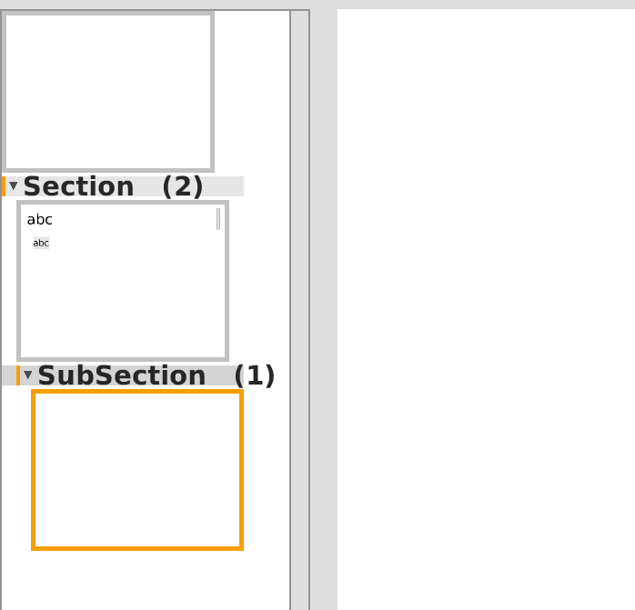
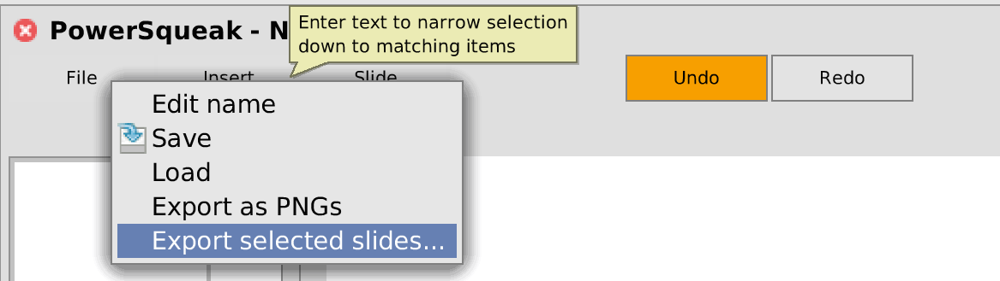
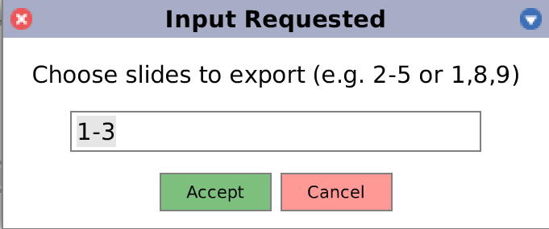

<h1> PowerSqueak</h1>

[](https://coveralls.io/github/hpi-swa-teaching/PowerSqueak?branch=main)

A presentation tool for the Squeak development platform

Supported platforms:
* Squeak 5.2
* Squeak 5.3
* Squeak 6.0

Squeak Trunk is also a target platform, but due to the fast changing nature of Trunk, certain versions of Squeak Trunk may not work.

Squeak 5.0 is officially unsupported (see the [CI build](https://github.com/hpi-swa-teaching/PowerSqueak/actions/workflows/ci.yml)).

## **Overview**
* [Overview](#overview)
* [Installation Instructions](#installation-instructions)
* [Build status](#build-status)
* [Using PowerSqueak](#using-powersqueak)
	* [Edit mode](#edit-mode)
		* [Undo & Redo](#undo--redo)
		* [Layouts](#layouts)
		* [Sections](#sections)
		* [Drag & Drop](#drag--drop)
	* [Presentation mode](#presentation-mode)
		* [Interactive/Non-Interactive mode](#interactivenon-interactive-mode)
		* [Timer](#timer)
	* [Saving and loading](#saving-and-loading)
		* [Saving selected slides](#saving-selected-slides)
* [Credits](#credits)

## **Installation Instructions**
For easy installation, please first install [Metacello](https://github.com/Metacello/metacello).

Then run the following code in your Squeak image:

For Squeak 5:
``` smalltalk
Metacello new
	baseline: 'Presenter';
	repository: 'github://hpi-swa-teaching/PowerSqueak:release/packages';
	get;
	load.
```

For Squeak 6:
``` smalltalk
Metacello new
	baseline: 'Presenter';
	repository: 'github://hpi-swa-teaching/PowerSqueak:main/packages';
	get;
	load.
```

Alternatively, download the .sar file from the [latest release](https://github.com/hpi-swa-teaching/PowerSqueak/releases/latest) and install it into your Squeak image via drag and drop (Squeak 5 only).

## **Build status**
| Build (`swt26-g01/main`) | Coverage (`main`) |
| --- | --- |
| [](https://github.com/hpi-swa-teaching/PowerSqueak/actions/workflows/ci.yml) | [](https://coveralls.io/github/hpi-swa-teaching/PowerSqueak?branch=main) |

## **Using PowerSqueak**
To open PowerSqueak either
*	run: `PSPresentationTool open. `
*	click PowerSqueak in the "Apps" drop-down-menu\
	

### **Edit mode**
During edit mode, you can use the menu to save, load, rename or export a presentation. With the "Insert" button you can add a text field, a code field, an image, a shape or slide numbers. Shapes include circles, lines, rectangles and arrows.
With the "Slide" button or the miniature context menu you can hide, delete, duplicate, move or save a slide as a layout. You can also give a slide a custom background color from the slide context menu.
Text fields support formatting such as text size, text color, bold, italic, underline, alignment and bullet lists. You can toggle, indent and outdent bullet lists from the text context menu.
A code field shows Smalltalk code with syntax highlighting and has a run button, so you can run the code right from the slide.

For advanced features, right-click the Morph. From its context menu you can delete, duplicate or recolor it, bring it to front or send it to back, resize text, or open a scripting tool to change the slide from code.\


You can now use the features in the Menu bar to edit your text. \


#### **Undo & Redo**
Most editing actions in PowerSqueak can be undone and redone.
Use the two undo/redo buttons in the top center of the toolbar:

* the left button undoes the last action,
* the right button redoes the action you just undid.

You can also use the keyboard: `Cmd + z` to undo and `Cmd + y` to redo (`Alt + z` / `Alt + y` on Linux and Windows).

#### **Layouts**
PowerSqueak supports reusable slide layouts. You can save a slide as a layout from its miniature context menu, and rename or delete existing layouts from the same menu.
To create a slide from a layout, click the "with Layout" button below the miniature list. When you hover over a layout in the layout chooser, you see a preview of it.



#### **Sections**
You can organize your slides into sections and subsections from the miniature context menu. Section headers are shown in the miniature sidebar and can be collapsed or expanded.
A section header lets you rename, delete, indent, outdent and move the section, as well as collapse all or expand all sections. When you delete a section, PowerSqueak asks whether you want to delete the section together with its slides, or keep the slides by moving them up to the parent section.
During a presentation you can jump to the next or previous section with the `n` and `p` keys.



#### **Drag & Drop**
You can drag a miniature slide with the left mouseclick and drop it anywhere. If you want to change the position of a miniature, drag the miniature and drop it on the lower half of the above slide. 

### **Presentation mode**
To enter presentation mode, click the "Present" button.

To control your presentation during presentation mode, use:

| Key | Action |
| ------- | ------- |
| Esc | Leave presentation mode |
| right arrow/arrow down/page down | next slide |
| left arrow/arrow up/page up | previous slide |
| Number keys | Jump to a slide number (0 = last slide) |
| i | (de-)activate interactivity and (un-)hide cursor |

Because PowerSqueak supports slide selection with both arrow and page keys, most wireless presenters will work correctly with PowerSqueak, but pressing the present button on your presenter will not work, as the Squeak VM does not support function keys.

#### **Interactive/Non-Interactive mode**
By pressing "i" during presentation mode, you can disable/enable interactivity and hide/unhide the cursor.
This mode is added to avoid the visual clutter of the cursor and to keep text on slides from grabbing the keyboard input, which prevents you from changing slides.

Leaving the presentation mode also enables interactivity and unhides the cursor.

Try out both modes. Interactive mode is one of the big advantages of PowerSqueak: you can add notes and react to feedback on the fly, show demos directly on the slides and interact with your audience in a way that normal slides do not allow.
It is worth taking a few minutes while preparing your talk to think about where this can make your presentation better.

#### **Timer**
In presentation mode PowerSqueak can show a small timer in the top-left corner. It works like a stopwatch and shows the time since you started it as minutes and seconds.
Press `t` to turn the timer on or off, and `h` to pause or resume it.

### **Saving and loading**
PowerSqueak can save and load presentations to/from the file system.

Use the corresponding save/load buttons in the "File" menu to save/load the presentation.



If you want to view the saved files, go to the `PSPresentation` directory in your Squeak VMs directory.
You can share presentations by copying any presentation in the `PSPresentation` directory into the `PSPresentation` directory of another image.
In the other image you can then load the presentation as usual in PowerSqueak.

If parts of a saved presentation are missing or corrupted, PowerSqueak tries to load the remaining content and tells you which metadata, morph files or layout directories are missing. You will get a notification.

``` diff
- Warning: some morphs may crash your image if they are saved/loaded!
- It is recommended, that you save your image before every save/load operation in PowerSqueak
```

You may also export your presentation to a list of .png files, which will get exported into the `PSPresentationsExports` folder in your Squeak VMs directory.

#### **Saving selected slides**
When saving, you can choose to export only specific slides instead of the whole presentation.
Enter the slide numbers in the save dialog using either:

* a range, e.g. `1-3` (saves slides 1, 2 and 3), or
* a comma-separated list, e.g. `1,2,3` (saves slides 1, 2 and 3).

You can also combine both, e.g. `1-3,5` saves slides 1, 2, 3 and 5.
Leaving the field empty saves the entire presentation.



## **Credits**
  * Team 2018: Leon Bein, Tom Braun, Maximilian König, Jonas Zimmermann, Leon Matthes
  * Team 2019: Mark Bader, Vincent Opitz, Julian Berger, Katharina Wille, Mona Sobhani
  * Team 2026: Marvin Heyne, Robert Vetter, Julian Windheuser, Jan-Erik Großmann, Tobias Krauth, Lukas Kresse, Sebastian Hahn
